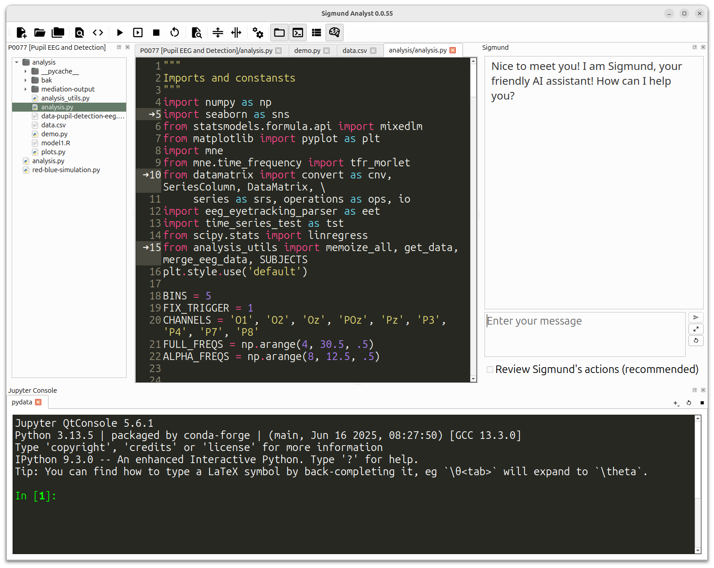

# PyQt Code Editor

__This code is under development and not ready for use__

Fully featured code-editor widgets for PyQt

Copyright 2025 Sebastiaan Mathôt


## About

This is a set of code-editor widgets for PyQt. They are inspired by PyQode, and contain much of the same functionality, but in a cleaner and more modern codebase.

Features:
    
- A splittable, tabbed editor panel
- Project explorer
- Find in files
- Syntax highlighting
- Code completion
- Code checking (linting)
- Code symbol navigation
- Search/ replace
- Completion of paired characers (e.g. brackets, quotes)
- Automatic indentation (Python)
- Smart shortcuts
- Zoom





## Usage

First, install all dependencies using:

```
pip install .
pip install pyqt6  # or pyqt5
```

Next, start one of the example scripts:

```
python example_editor.py
python example_ide.py
```


## License

`PyQt Code Editor` is licensed under the [GNU General Public License
v3](http://www.gnu.org/licenses/gpl-3.0.en.html).
